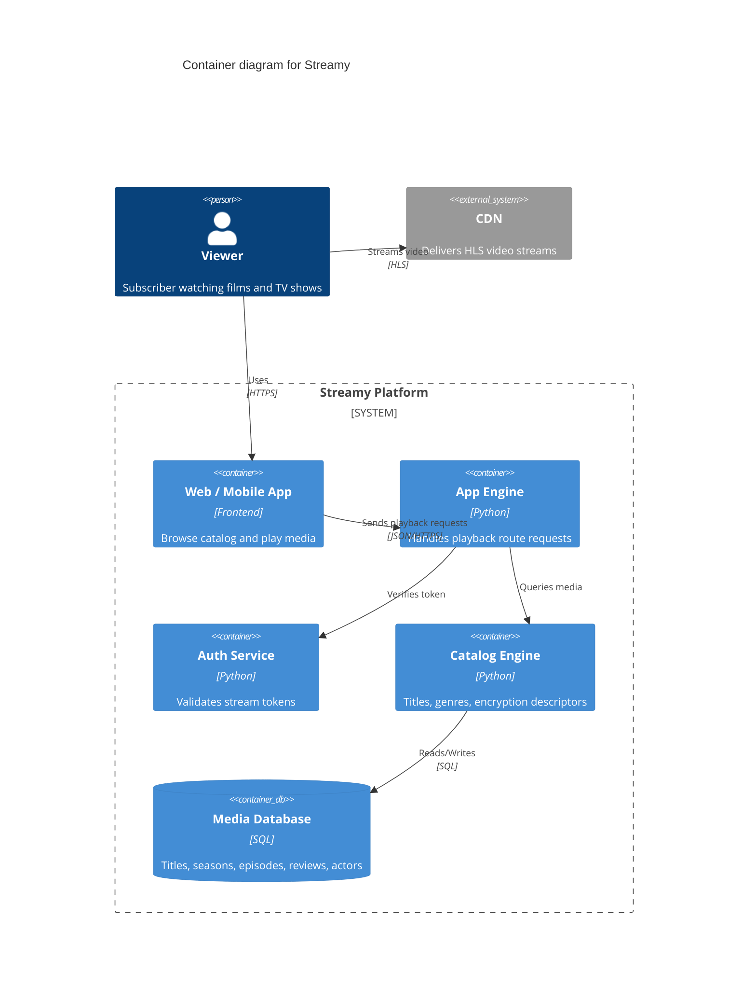

# Container Architecture

```mermaid
C4Container
    title Container diagram for Streamy

    Person(viewer, "Viewer", "Subscriber watching films and TV shows")

    System_Boundary(streamy, "Streamy Platform") {
        Container(app, "Web / Mobile App", "Frontend", "Browse catalog and play media")
        Container(engine, "App Engine", "Python", "Handles playback route requests")
        Container(auth, "Auth Service", "Python", "Validates stream tokens")
        Container(catalog, "Catalog Engine", "Python", "Titles, genres, encryption descriptors")
        ContainerDb(db, "Media Database", "SQL", "Titles, seasons, episodes, reviews, actors")
    }

    System_Ext(cdn, "CDN", "Delivers HLS video streams")

    Rel(viewer, app, "Uses", "HTTPS")
    Rel(app, engine, "Sends playback requests", "JSON/HTTPS")
    Rel(engine, auth, "Verifies token")
    Rel(engine, catalog, "Queries media")
    Rel(catalog, db, "Reads/Writes", "SQL")
    Rel(viewer, cdn, "Streams video", "HLS")
```